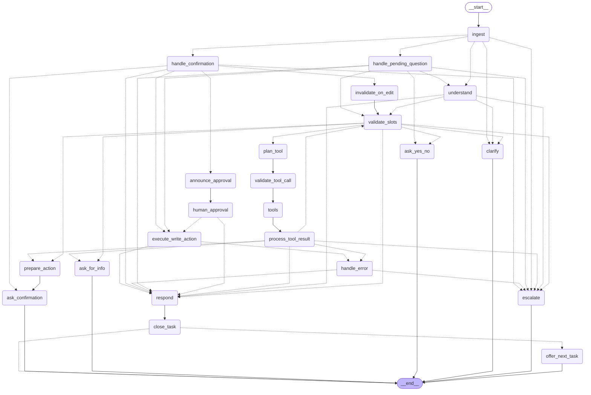

# Support graph

Generated by `support graph draw` from the compiled LangGraph (do not edit by hand).

```mermaid
---
config:
  flowchart:
    curve: linear
---
graph TD;
	__start__([<p>__start__</p>]):::first
	ingest(ingest)
	understand(understand)
	validate_slots(validate_slots)
	ask_for_info(ask_for_info)
	ask_yes_no(ask_yes_no)
	clarify(clarify)
	plan_tool(plan_tool)
	validate_tool_call(validate_tool_call)
	process_tool_result(process_tool_result)
	prepare_action(prepare_action)
	ask_confirmation(ask_confirmation)
	handle_confirmation(handle_confirmation)
	invalidate_on_edit(invalidate_on_edit)
	announce_approval(announce_approval)
	human_approval(human_approval)
	execute_write_action(execute_write_action)
	handle_pending_question(handle_pending_question)
	handle_error(handle_error)
	escalate(escalate)
	respond(respond)
	close_task(close_task)
	offer_next_task(offer_next_task)
	tools(tools)
	__end__([<p>__end__</p>]):::last
	__start__ --> ingest;
	announce_approval --> human_approval;
	close_task -.-> __end__;
	close_task -.-> offer_next_task;
	execute_write_action -.-> handle_error;
	execute_write_action -.-> respond;
	handle_confirmation -.-> announce_approval;
	handle_confirmation -.-> ask_confirmation;
	handle_confirmation -.-> escalate;
	handle_confirmation -.-> execute_write_action;
	handle_confirmation -.-> invalidate_on_edit;
	handle_confirmation -.-> respond;
	handle_error -.-> escalate;
	handle_error -.-> respond;
	handle_pending_question -.-> ask_yes_no;
	handle_pending_question -.-> escalate;
	handle_pending_question -.-> execute_write_action;
	handle_pending_question -.-> respond;
	handle_pending_question -.-> understand;
	handle_pending_question -.-> validate_slots;
	human_approval -.-> execute_write_action;
	human_approval -.-> respond;
	ingest -.-> clarify;
	ingest -.-> escalate;
	ingest -.-> handle_confirmation;
	ingest -.-> handle_pending_question;
	ingest -.-> understand;
	invalidate_on_edit --> validate_slots;
	plan_tool --> validate_tool_call;
	prepare_action --> ask_confirmation;
	process_tool_result -.-> ask_for_info;
	process_tool_result -.-> escalate;
	process_tool_result -.-> handle_error;
	process_tool_result -.-> prepare_action;
	process_tool_result -.-> respond;
	process_tool_result -.-> validate_slots;
	respond --> close_task;
	tools --> process_tool_result;
	understand -.-> clarify;
	understand -.-> escalate;
	understand -.-> respond;
	understand -.-> validate_slots;
	validate_slots -.-> ask_for_info;
	validate_slots -.-> ask_yes_no;
	validate_slots -.-> clarify;
	validate_slots -.-> escalate;
	validate_slots -.-> plan_tool;
	validate_slots -.-> prepare_action;
	validate_slots -.-> respond;
	validate_tool_call --> tools;
	ask_confirmation --> __end__;
	ask_for_info --> __end__;
	ask_yes_no --> __end__;
	clarify --> __end__;
	escalate --> __end__;
	offer_next_task --> __end__;
	classDef default fill:#f2f0ff,line-height:1.2
	classDef first fill-opacity:0
	classDef last fill:#bfb6fc
```
